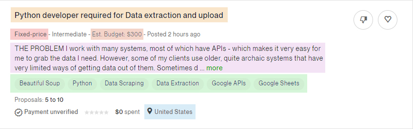
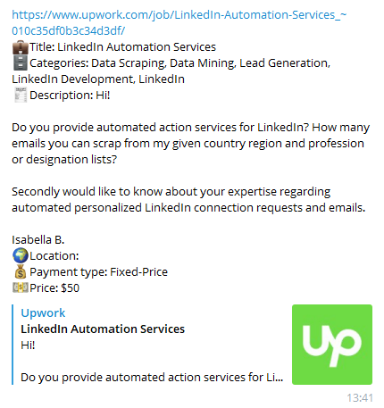

# 
Telegram bot

Bot is created for searching a freelance jobs in Data field and sending notifications via Telegram app.

## Upwork

A screenshot of an Upwork job

On Upwork's search page jobs are listed with some short description. Desired data to scrap:
 - Title;
 - Description;
 - Payment type and price;
 - Location;
 - Categories.

To prevent blocking from Upwork (403 status code) requests are only being send between 12AM and 12PM with various time intervals between 3-5 minutes.
Although avoiding blocking is not guaranteed!

A message sent from bot

